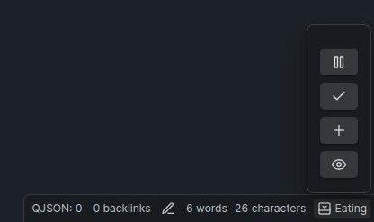

# 📋 Doing

## 🎉 Introduction

Welcome to **Doing**, an Obsidian plugin designed to help you keep track of what task you were doing. This plugin is perfect for users who often find themselves switching contexts and need a quick reminder of their current task.

## 🚀 Features

- 📌 **Task Display**: Shows the current task in the status bar for easy reference.
- 📝 **Task Logging**: Stores all tasks in a file for future reference.

## 📖 Usage

1. **Add a Task**: To add a task, use the command palette (Ctrl/Cmd+P) and search for "doing: Add Task". Enter your task description and hit Enter.
2. **View Current Task**: Your current task will be displayed in the status bar at the bottom of Obsidian.
3. **Complete a Task**: Once you've completed a task. The task will be logged in `doing.md` with a timestamp.
4. **View Task History**: Open `doing.md` to see a history of all your tasks.

## 🌟 Contributing

We welcome contributions! If you have ideas for new features or improvements, feel free to open an issue or submit a pull request on our [GitHub repository](https://github.com/rooyca/doing).

## 📞 Support

If you encounter any issues or have questions, please open an issue on GitHub or reach out via our [support page](https://github.com/rooyca/doing/issues).

## 📝 License

This plugin is licensed under the MIT License. See the [LICENSE](https://github.com/rooyca/doing/blob/main/LICENSE) file for more details.